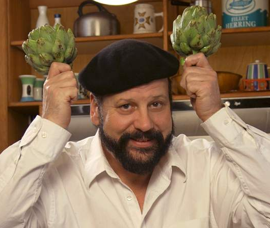
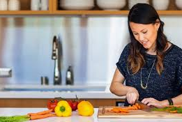

## User Stories

### Bill

"I don't cook as often as I'd like to, so when I do I'm always scrolling back and forth to check how much of which ingredient I should be using.  I'd like to be able to see the amount I need without losing my place in the directions."

---

### Harold

"As a busy family chef, I cook big dinners several nights a week.  I need to access our favorite recipes quickly, and make changes to suit my family's tastes, so that everyone is happy with dinner and we have more family time in the evenings."

---

### Ted

 "I inherited a shoebox filled with recipes on old, smudged index cards from my grandma.  I'd love to save these recipes digitally and make them easier to read so I can relive my childhood through them whenever I want.

---

### Maude

"I'm a foodie, so I like to experiment with new recipes and tinker with them to get them just right.  I need a customizable cookbook so that I can collect great recipes, keep track of the adjustments I make, and impress dinner guests with my refined cuisine."

---

[Go back](README.md)